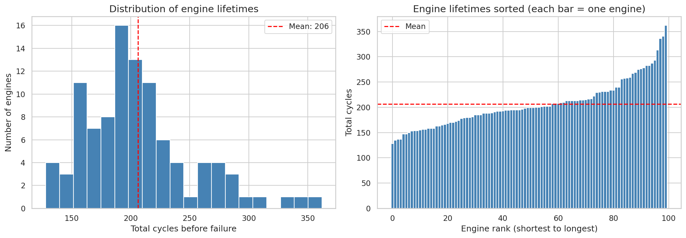
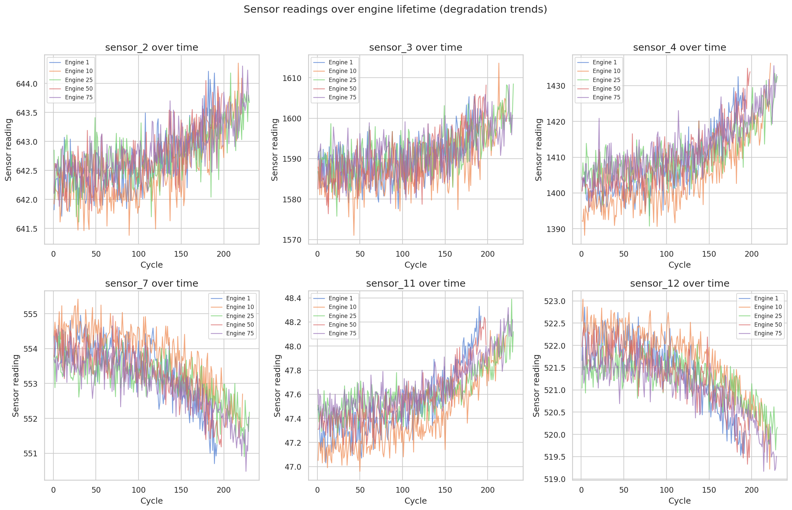
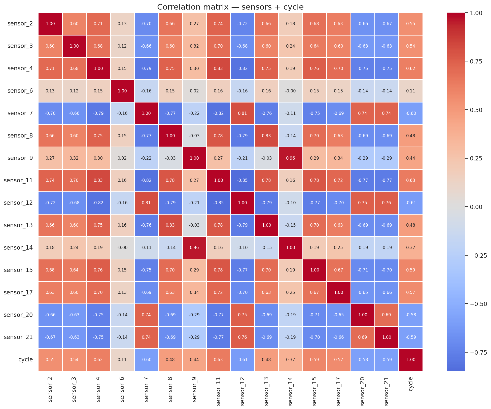
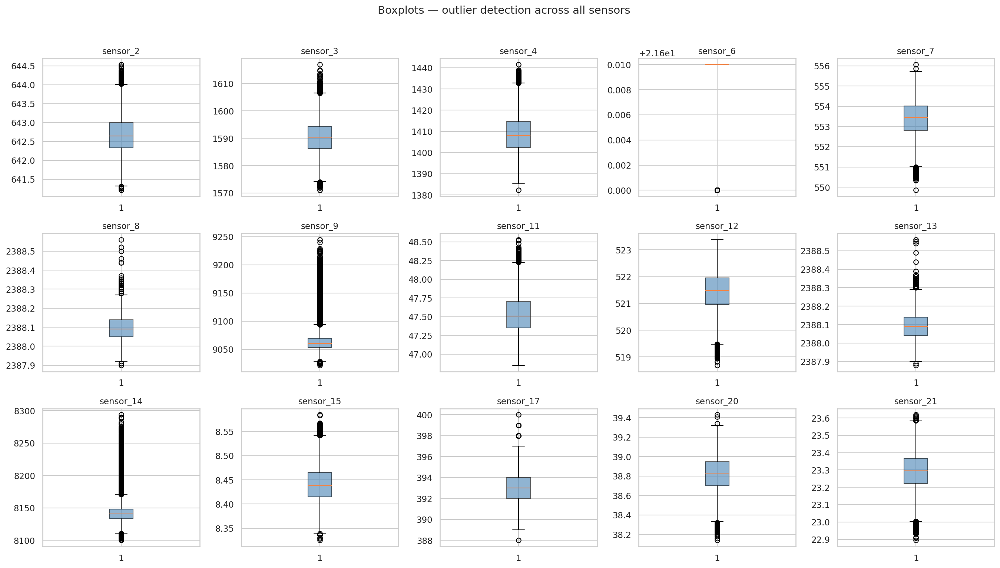
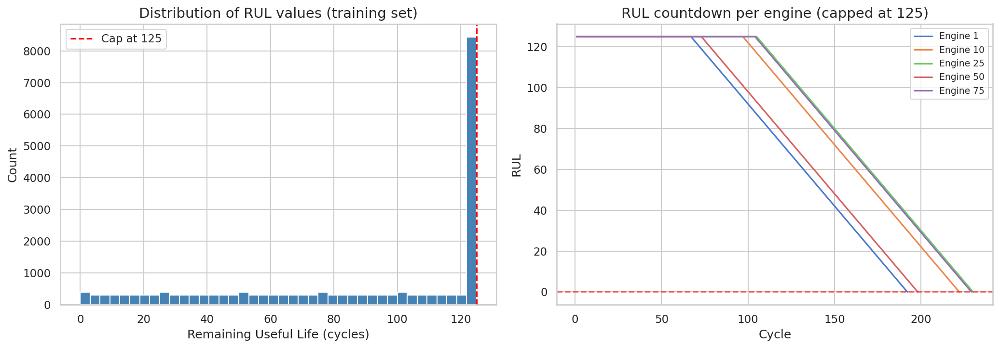
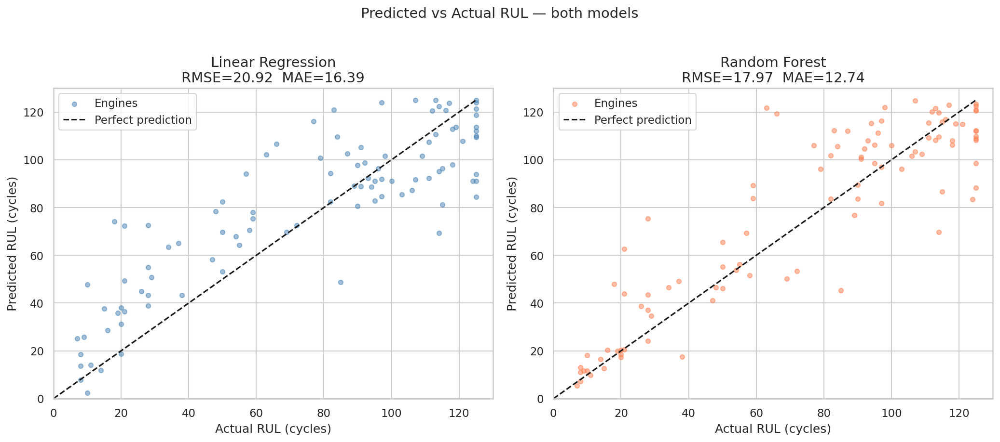
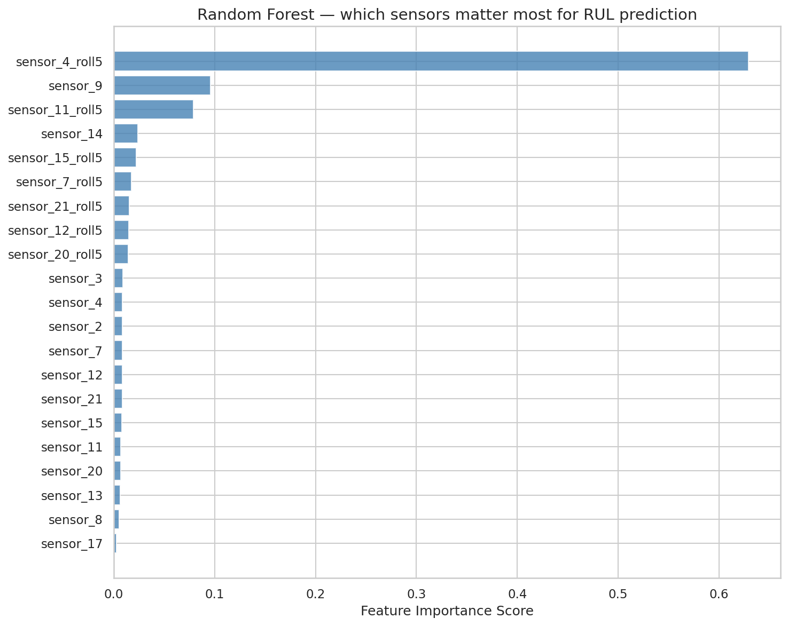
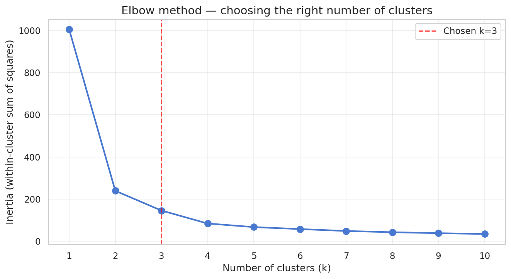
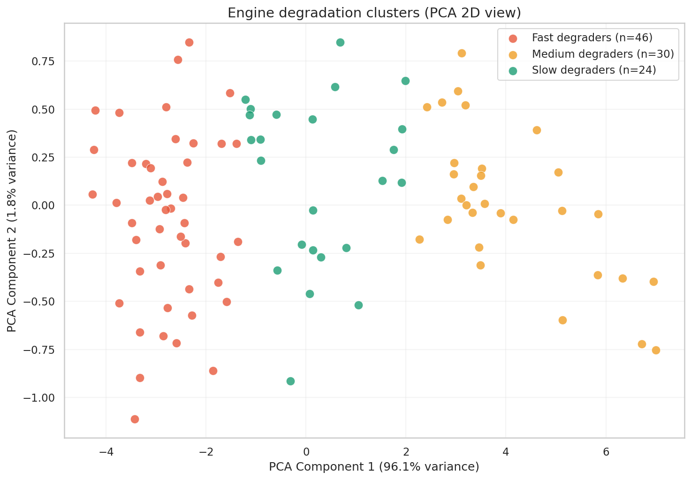
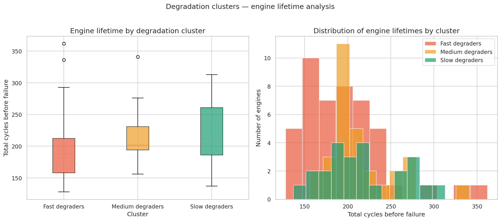

# ✈️ Predictive Maintenance of Turbofan Engines

**Tools:** Python · pandas · NumPy · scikit-learn · matplotlib · seaborn  
**Dataset:** NASA CMAPSS FD001  
**Type:** Machine Learning — Regression + Clustering

---

## Project Overview

Built a complete end-to-end machine learning pipeline to predict 
the Remaining Useful Life (RUL) of turbofan jet engines using 
NASA's CMAPSS FD001 dataset.

The project covers data loading, cleaning, exploratory data 
analysis, feature engineering, regression modeling, 
and unsupervised clustering.

---

## Results

| Model | RMSE | MAE |
|---|---|---|
| Linear Regression (baseline) | 20.92 cycles | 16.39 cycles |
| **Random Forest (best)** | **17.97 cycles** | **12.74 cycles** |
| Published benchmark | ~30–35 | — |

- **14.1% RMSE improvement** over Linear Regression
- **Beat published benchmark by ~40%** through feature engineering alone

---

## Dataset

**NASA CMAPSS FD001** — Commercial Modular Aero-Propulsion System Simulation

| File | Content |
|---|---|
| `train_FD001.txt` | 20,631 rows — 100 engines run to failure |
| `test_FD001.txt` | 13,096 rows — engines cut off mid-life |
| `RUL_FD001.txt` | 100 true RUL values (ground truth) |

26 columns per row: engine_id, cycle, 3 operational settings, 21 sensor readings.

---

## Project Pipeline

### 1. Data Loading & Cleaning
- Loaded space-separated files with manual column naming
- Checked for missing values — zero found
- Dropped 7 constant sensors (std < 0.001)
- Dropped sensor_6 (cycle correlation r = 0.11 — no degradation signal)
- **Result: 14 useful sensors retained**

### 2. Exploratory Data Analysis
- Engine lifetime distribution: 128 to 362 cycles (mean 206)
- Sensor trend plots: sensors 4, 11, 15 rise with age; sensors 7, 12, 20, 21 fall
- Correlation heatmap: sensor_11 highest cycle correlation (r = 0.63)
- Z-score outlier analysis: max 2.5% outlier rate — kept all (genuine operational extremes)

### 3. Feature Engineering
- **RUL column:** max_cycle − current_cycle, capped at 125
- **Rolling averages:** 5-cycle rolling mean on 7 key sensors per engine
- **Z-score normalization:** StandardScaler fitted on training data only (data leakage prevention)

### 4. Regression Modeling
- Linear Regression as baseline
- Random Forest (100 trees, random_state=42)
- Evaluated with RMSE and MAE on test set
- Feature importance analysis

### 5. K-Means Clustering
- Degradation profiles built from last 20 cycles per engine
- Elbow method determined k=3
- PCA reduced 14D to 2D for visualization
- 3 clusters: Fast Degraders (avg 194.5 cycles), Medium (215.2), Slow (217.9)

---

## Key Findings

**Biggest Finding:**
> Raw sensor_4 importance = 0.01 (ranked 19th).  
> sensor_4_roll5 importance = 0.63 (ranked 1st).  
> Same sensor — one rolling average transformation — 63x improvement.

**Feature Engineering beats Algorithm Choice:**
Both models beat the published benchmark of RMSE 30-35 purely 
through better features — not better algorithms.

**Safety Critical Finding:**
Linear Regression over-predicts RUL near failure — it tells 
operators an engine is fine when it is actually close to failing. 
Random Forest is significantly safer in the low-RUL zone.

**Clustering Surprise:**
Clusters 1 and 2 have nearly identical lifetimes (215 vs 218 cycles) 
but completely different sensor fingerprints — multiple degradation 
pathways can lead to the same total engine lifespan.

---

## Plots

| Plot | Description |
|---|---|
|  | Engine lifetime histogram and sorted bar |
|  | Sensor degradation trends over cycle |
|  | Sensor correlation matrix |
|  | Outlier detection across all sensors |
|  | RUL histogram and countdown |
|  | Predicted vs Actual RUL — both models |
|  | Random Forest feature importance |
|  | K-Means elbow method |
|  | Engine degradation clusters (2D) |
|  | Lifetime by cluster |

---

## Recommendations

1. Deploy Random Forest — not Linear Regression — for any safety-critical RUL system
2. Implement cluster-aware maintenance alerts — Cluster 0 engines need 20 earlier cycles
3. Monitor 8 key sensors: sensor_4, 7, 11, 12, 15, 20, 21, 3
4. Apply 5-cycle EWMA smoothing to live sensor data before prediction
5. Set maintenance trigger at 30 cycles remaining (accounts for ~13 cycle MAE)
6. Validate on FD002–FD004 before real fleet deployment

---

## Files in This Repository

| File | Description |
|---|---|
| `CMAPSS_Analysis.ipynb` | Complete Python notebook |
| `plot1_engine_lifetimes.png` | Engine lifetime charts |
| `plot2_sensor_trends.png` | Sensor degradation trends |
| `plot3_correlation_heatmap.png` | Correlation matrix |
| `plot4_boxplots.png` | Boxplot outlier analysis |
| `plot5_RUL_distribution.png` | RUL distribution |
| `plot6_predictions_vs_actual.png` | Model scatter plots |
| `plot7_feature_importance.png` | Feature importance chart |
| `plot8_elbow.png` | Elbow method plot |
| `plot9_clusters_pca.png` | PCA cluster scatter |
| `plot10_cluster_lifetimes.png` | Cluster lifetime boxplots |

---

## Libraries Used

```python
import pandas as pd
import numpy as np
import matplotlib.pyplot as plt
import seaborn as sns
from sklearn.linear_model import LinearRegression
from sklearn.ensemble import RandomForestRegressor
from sklearn.preprocessing import StandardScaler
from sklearn.metrics import mean_squared_error, mean_absolute_error
from sklearn.cluster import KMeans
from sklearn.decomposition import PCA
from scipy import stats
```
